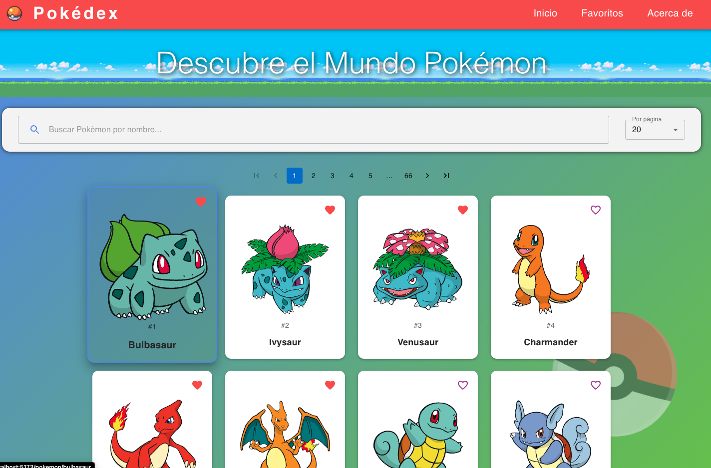

# Pokédex Demo

Una Pokédex interactiva construida con React, Vite y Material UI, que permite explorar, buscar y conocer detalles de todos los Pokémon utilizando la [PokeAPI](https://pokeapi.co/).



---

## 🚀 Demo

Accede a la demo en línea: [walmonfort:pokedex](https://pokedex-buzly-ai.vercel.app/)

---

## ✨ Características

- Búsqueda y filtrado de Pokémon por nombre o número
- Visualización de detalles, tipos, habilidades y stats
- Favoritos locales (persisten en el navegador)
- Paginación y navegación rápida
- Diseño responsive y moderno (Material UI)
- Integración con [PokeAPI](https://pokeapi.co/)

---

## 🛠️ Tecnologías

- [React](https://react.dev/)
- [Vite](https://vitejs.dev/)
- [Material UI](https://mui.com/)
- [PokeAPI](https://pokeapi.co/)

---

## ⚡ Instalación y uso local

1. **Clona el repositorio**
   ```bash
   git clone https://github.com/WallMonfortt/pokedex-BuzlyAi.git
   cd pokedex-BuzlyAi
   ```

2. **Instala las dependencias**
   ```bash
   npm install
   # o
   pnpm install
   ```

3. **Inicia la app en modo desarrollo**
   ```bash
   npm run dev
   # o
   pnpm dev
   ```

4. Abre [http://localhost:5173](http://localhost:5173) en tu navegador.

---

## 📁 Estructura principal

```
public/
  WM2.svg            # Logo personal
  ...
src/
  components/        # Componentes reutilizables
  pages/             # Vistas principales (Home, Favoritos, Acerca de)
  router/            # Rutas de la app
  ...
```

---

## 👤 Autor y créditos

Desarrollado por [Wall Monfortt](https://walmonfortt.com)

- [GitHub](https://github.com/WallMonfortt)
- [LinkedIn](https://www.linkedin.com/in/jose-gualberto-monfortte-flores/)

Logo y recursos visuales © Wall Monfortt. Datos de Pokémon gracias a [PokeAPI](https://pokeapi.co/).

---

## 📝 Licencia

Este proyecto es solo para fines educativos y demostrativos. No afiliado a Nintendo, Game Freak ni The Pokémon Company.

---

¡Si te gusta el proyecto, no olvides dejar una estrella en GitHub! ⭐
